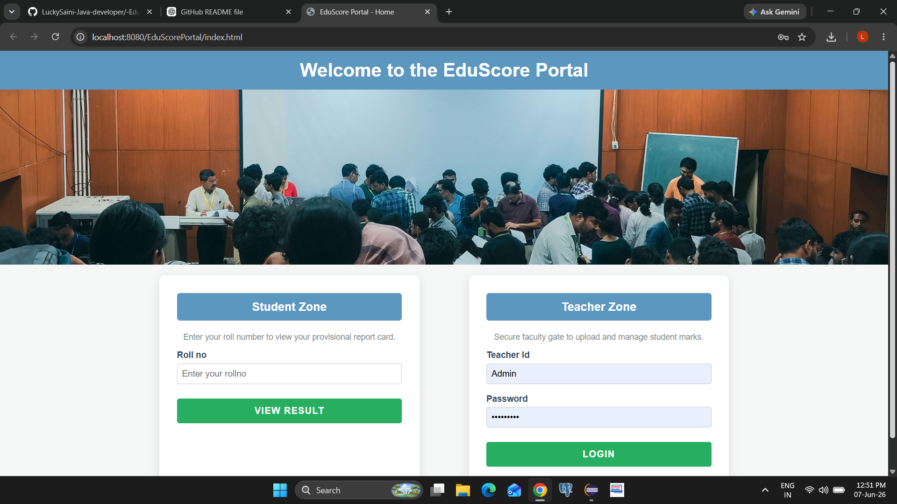
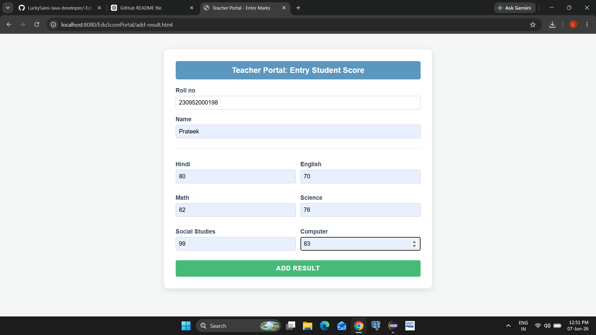
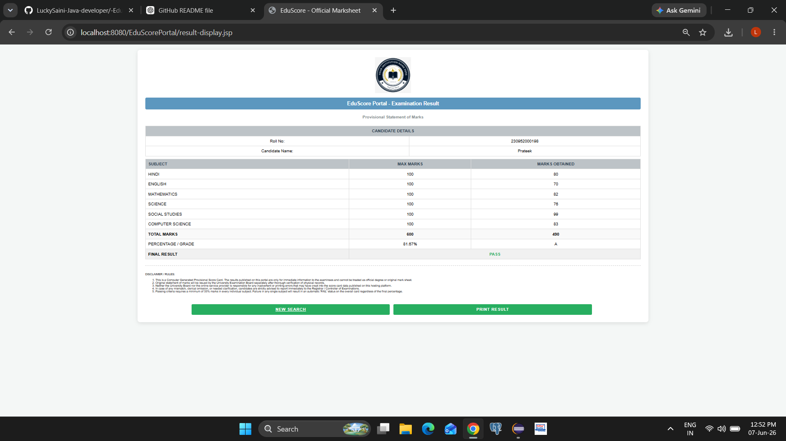
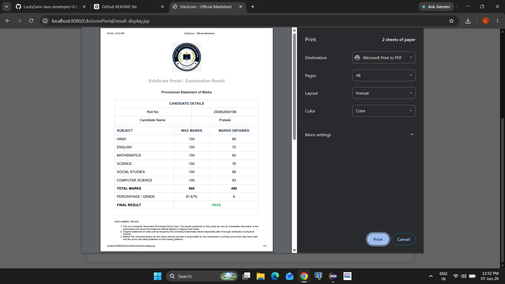

# 🎓 EduScore-Portal - Student Result Management System

### 🛠️ Tech Stack: `Java` | `PostgreSQL` | `Apache Tomcat` | `Eclipse IDE`

EduScore Portal is a secure, role-based student result management web application. It bridges the gap between faculty and students by providing a seamless interface for teachers to upload marks and students to instantly view/print their report cards using unique roll numbers.

---

## 🚀 Core Features

* **🔒 Role-Based Access:** Separate panels and secure entry for Teachers and Students.
* **✍️ Smart Marks Upload:** Teachers can easily input and submit students' subject-wise marks.
* **🔍 Instant Retrieval:** Students can view their specific results instantly using their Roll Number.
* **🖨️ A4 Print Ready:** Built-in CSS `@media print` rules ensuring the generated marksheet scales perfectly on physical A4 paper.
* **⚡ Clean Validation:** Frontend validation using JavaScript to prevent incorrect form submissions.

---

## 🛠️ Tech Stack & Architecture


| Layer | Technology Used |
| :--- | :--- |
| **Frontend** | HTML5, CSS3 (Flexbox & Grid), JavaScript (ES6) |
| **Backend** | Java Server Pages (JSP), Servlets |
| **Database** | PostgreSQL Engine |
| **Server / Environment** | Apache Tomcat Server, Java Runtime Environment (JRE) |
| **IDE** | Eclipse IDE for Enterprise Java Developers |

---

## 📂 Project Directory Structure

```text
EduScore-Portal/
├── screenshots/          # Application UI Screen Captures
│   ├── homepage.png
│   ├── teacher.png
│   ├── result.png
│   └── print.png
├── index.html            # Main Landing Page (Student Portal Entrance)
├── teacher-login.jsp     # Authentication Gate for Faculty
├── insert-result.jsp     # Form Interface for Uploading Student Marks
├── result-display.jsp    # Dynamic Marksheet Generator (Fetches from DB)
├── add-result.html       # Static Route Reference
├── style.css             # Unified Responsive Stylesheet
└── script.js             # Client-side Form Validations
```

---

## 📸 Application Walkthrough (Screenshots)

### 🏠 1. Interactive Homepage
*The entry point where students enter their roll number to fetch records.*


---

### 🧑‍🏫 2. Faculty Dashboard (Marks Ingestion)
*Secure form interface used by teachers to add or update individual student marks.*


---

### 📊 3. Student Marksheet View
*Dynamically populated report card rendering scores directly from the PostgreSQL backend.*


---

### 🖨️ 4. Print Layout Utility (A4 Optimized)
*Clean printable view with navigation elements automatically hidden for a professional hard-copy format.*


---

## ⚙️ Deployment & Setup Instructions

### Prerequisites
* Eclipse IDE installed.
* Apache Tomcat 9.0+ configured.
* PostgreSQL database instance running.

### Execution Steps
1. **Clone & Import:** Import this repository into your Eclipse Workspace as a *Dynamic Web Project*.
2. **Database Setup:** Run your PostgreSQL server and create a database named `eduscore`. Create tables matching your project's JDBC schema.
3. **Driver Configuration:** Ensure the PostgreSQL JDBC Driver (`.jar`) is placed inside the `WEB-INF/lib` folder of the project.
4. **Server Mapping:** Right-click the project ➡️ **Run As** ➡️ **Run on Server** ➡️ Select your **Apache Tomcat** configuration.

---

## 📌 Author & Developer

* **Lucky Saini**
* *Java Developer & Full-Stack Enthusiast* 💻
* [GitHub Profile](https://github.com)

---

## 🎯 Conclusion

This project serves as an enterprise-grade demonstration of full-stack Java Web Development. It perfectly highlights data integrity using relational databases, dynamic rendering via JSP, and production-ready print styling.
